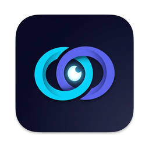
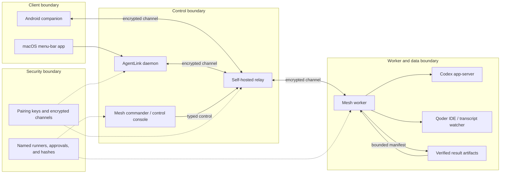

<div align="center">



# Argus

**Keep your Mac awake while coding agents work, then restore normal sleep when they stop.**

[](https://www.apple.com/macos/)
[](https://swift.org)
[](LICENSE)

<!-- i18n-langbar -->
**English** · [한국어](README.ko.md) · [中文](README.zh-CN.md) · [日本語](README.ja.md) · [Español](README.es.md)

</div>

Argus is a local macOS menu-bar app with an AgentLink daemon, an optional
self-hosted relay, a Mesh control path, and an Android companion. It observes
local agent activity and exposes only the explicitly enabled, typed operations
that each paired device is allowed to use.

**Prerequisites and boundaries:** the source build currently targets Apple
silicon (arm64) with a macOS 13.0 deployment target; it does not produce an
Intel binary. The daemon and relay use Bun; the Android companion uses JDK 17
and Android SDK API 35. No hosted relay, API key, signing credential, or private
deployment endpoint is included. A relay, remote Codex app-server, Mesh worker,
and phone connection are optional and must be configured by their owner.

## Quick start

Build and open the macOS app from the repository root:

```bash
ARGUS_SIGN_ID=- ./scripts/build.sh
open build/Argus.app
```

The app appears in the menu bar. Use **Settings** to choose the agent traces to
watch and the safety policy. For source-level checks, run the commands in
[Testing](#testing).

## Architecture

The diagram shows the client, control, worker/data, and security boundaries.
The relay forwards encrypted channel frames; it does not receive plaintext
prompts, files, credentials, or runner configuration.



## Components

### macOS app

The Swift/AppKit app owns the menu-bar interaction and the local keep-awake
policy. It watches configured transcript locations by file activity, applies
battery, temperature, duration, and remote-activity safety rules, and restores
normal sleep when the hold is no longer justified. The app does not need the
relay for local keep-awake behavior.

The menu includes the manual **Keep Mac Awake** action, agent watch controls,
the monitor, settings, and quit. The command-line interface can operate the
same local policy without opening the menu.

### AgentLink daemon

The TypeScript/Bun daemon owns pairing, encrypted channel framing, transcript
watching, Codex control, Qoder input delivery, Mesh policy, approvals, and
durable task state. Run it from `agentlink/`; the default relay address is a
local development value and is not a hosted service.

The daemon can run as a watcher, an always-on paired host, or a local control
server. Argus can spawn the watcher after its Bun and checkout preflight passes.

### Relay

The relay is a small WebSocket forwarder. A channel has two explicit sides, and
buffered frames remain associated with their intended side across reconnects.
It performs no agent work and has no decryption key. Deploy one behind your own
TLS termination or use a private development relay. The service and proxy
examples are in [`agentlink/deploy/`](agentlink/deploy/).

### Mesh commander and worker

The commander discovers paired resources and submits typed Mesh tasks. The
worker is the target daemon that owns the resource path, runner executable,
approval decision, task journal, and artifact store. A resource can expose
inspect, quarantine, and owner-configured named task runners. Remote input
cannot choose a command, working directory, environment, or shell.

Mesh configuration is opt-in. Invalid groups, resource bindings, runner
definitions, signatures, approvals, or audit records fail closed. See
[`docs/mesh.md`](docs/mesh.md) for the protocol and task lifecycle.

### Android companion

The Android source in [`android/`](android/) contains two launchable modes:

- **Argus** pairs with an Argus Host through the self-hosted AgentLink relay.
- **Phone Agent** is a separate file agent that calls its configured HTTPS
  model endpoint directly and does not require an Argus Host connection.

The pairing mode can monitor agent events, send input, show approvals, and
control the operations supported by the connected daemon. The standalone mode
keeps its API key in Android Keystore and requires confirmation for writes and
archive extraction.

### Remote Codex control

Remote Codex control speaks to the target's Codex app-server through the
encrypted AgentLink path. It lists threads, resumes a selected thread, sends
input, pages history and events, interrupts or steers an active turn, and
answers the target's approval requests. It is enabled only when the target
Mesh policy sets `remoteCodexControl: true`.

Qoder uses a different path: the IDE owns its live sessions, so the daemon
observes transcripts and can inject input where configured. Qoder input cannot
interrupt a turn already running. The daemon never treats Qoder or Codex text
as a shell command.

## Install and configure

### macOS app

The repository has no Swift Package Manager manifest. The build script invokes
`swiftc` directly and produces `build/Argus.app`:

```bash
ARGUS_SIGN_ID=- ./scripts/build.sh
open build/Argus.app
```

The signed distribution may be installed separately. The deprecated privileged
helper remains for the CLI timed hold and hook compatibility; the normal
keep-awake path uses the app's activity assertion.

### AgentLink daemon

Install the locked Bun workspace and start the paired watcher with an explicit
relay address:

```bash
cd agentlink
/opt/homebrew/bin/bun install --frozen-lockfile
AGENTLINK_RELAY=wss://relay.example/ws /opt/homebrew/bin/bun run packages/daemon/src/index.ts watch
```

The relay URL is an example shape, not a repository default. Pair the phone or
another host using the daemon's `pair`, `join`, or `probe` commands, then keep
the daemon running on the host that owns the local agent or Mesh resource.

### Android companion

Use the instructions in [`android/README.md`](android/README.md). The minimal
debug build flow is:

```bash
cd android
export JAVA_HOME=/opt/homebrew/opt/openjdk@17/libexec/openjdk.jdk/Contents/Home
export ANDROID_HOME="$HOME/Library/Android/sdk"
./gradlew assembleDebug
adb install -r app/build/outputs/apk/debug/app-debug.apk
```

The Android build does not contain a public relay endpoint. Enter the relay
address in the app or use a pairing link generated for your deployment.

### Mesh configuration

Create a `mesh.json` on each target from the examples in
[`agentlink/deploy/`](agentlink/deploy/), and set `AGENTLINK_MESH_CONFIG` when
the file is outside the default AgentLink state directory. A target resource
must name its owner node, absolute local root, trusted groups, and any status or
task runner. Runner executables and fixed environment values remain local.

For KMac, the documented preparation flow creates the workspace status runner
and the fixed `kmac-github-status-v1` runner. The latter invokes only GitHub's
status operation, strips process credential overrides, and returns the safe
states `authenticated`, `unauthenticated`, `unavailable`, or `error`. See
[`agentlink/deploy/KMAC_READINESS.md`](agentlink/deploy/KMAC_READINESS.md).

## CLI and use cases

Run the daemon CLI from `agentlink/`:

```bash
/opt/homebrew/bin/bun run packages/daemon/src/index.ts init
/opt/homebrew/bin/bun run packages/daemon/src/index.ts pair --watch
/opt/homebrew/bin/bun run packages/daemon/src/index.ts join <pairing-code>
/opt/homebrew/bin/bun run packages/daemon/src/index.ts up
/opt/homebrew/bin/bun run packages/daemon/src/index.ts watch
/opt/homebrew/bin/bun run packages/daemon/src/index.ts peers --json
/opt/homebrew/bin/bun run packages/daemon/src/index.ts mesh status
/opt/homebrew/bin/bun run packages/daemon/src/index.ts mesh resources
/opt/homebrew/bin/bun run packages/daemon/src/index.ts control
```

Use `pair --watch` for a newly paired host, `up` for a paired host that waits
for its channel, and `watch` when local transcript or hook observation is
enabled. `mesh resources` shows safe resource and runner metadata; it does not
print executable paths, fixed arguments, environments, or private keys.

The root macOS CLI is installed with the app build and supports local actions
such as:

```text
argus on [--for <duration>] [--forever]
argus off
argus status [--json]
argus repair
argus keep --while <pid>
argus watch <agent> [--grace seconds] [--check-interval seconds] [--max minutes] [--json]
argus session start <name>
argus session stop <name>
argus session list [--json]
argus monitor
argus debug [agents] [--json]
argus help
```

## Deployment

The relay deployment examples include a systemd service, nginx configuration,
and a health endpoint. Start the relay with the workspace script during local
development:

```bash
cd agentlink
/opt/homebrew/bin/bun run relay
```

For a host deployment, review [`agentlink/deploy/ARGUS_HOST.md`](agentlink/deploy/ARGUS_HOST.md),
[`agentlink/deploy/ARGUS_HOST_WINDOWS.md`](agentlink/deploy/ARGUS_HOST_WINDOWS.md),
and [`agentlink/deploy/SEOUL_CONTROL.md`](agentlink/deploy/SEOUL_CONTROL.md).
Keep the relay and control console behind your own access boundary. The control
console is intended to be reached through an authenticated local or forwarded
connection, not by exposing a daemon HTTP port on a LAN.

KMac release preparation and activation are separate owner-controlled steps.
[`agentlink/deploy/KMAC_READINESS.md`](agentlink/deploy/KMAC_READINESS.md)
documents the read-only checks, fixed GitHub runner, candidate config, and
release workflow. It does not activate a watcher, replace live state, or claim
that a deployment succeeded.

## Result artifacts

Mesh task results are durable records keyed by `taskId`. A task runner may
return a bounded result summary and, when its capability allows it, a
content-addressed result artifact. Artifact metadata includes stable file paths,
file mode, byte size, SHA-256, and changed/deleted entries. File bodies are
optional and are sent only when they fit the endpoint budget.

The controller verifies the task binding, artifact ID, declared SHA-256, file
content hashes, and manifest hash before returning an artifact envelope. If
optional bodies are too large, metadata remains available and the response
sets truncation metadata; it never claims a complete body set. Invalid,
malformed, mismatched, or task-unbound artifacts fail closed.

## Approvals and security

- Pairing establishes the device identity and encrypted channel keys.
- Mesh groups, requesters, resources, operations, runner IDs, and timeouts are
  checked at the target.
- Named task runners are owner-configured. A requester cannot provide a shell
  command, executable, cwd, environment, or arbitrary token.
- Task runners that change a target require a target-owner approval unless an
  exact owner policy permits the bounded unattended path.
- Result artifacts are verified by stable task binding and content hashes before
  delivery.
- Remote Codex approvals are server requests correlated to the target thread;
  they are not inferred from agent text.
- Readiness and runner errors are reduced to fixed states and error codes. Raw
  stdout, stderr, credentials, keychain material, and environment values stay
  local.

The macOS app reads configured file activity and local system signals. It does
not upload transcripts. Optional Telegram notifications and AgentLink relay
traffic are separate, explicitly configured features. See
[`docs/security.md`](docs/security.md).

## Troubleshooting

### Reconnect

The reconnect supervisor uses bounded exponential backoff with jitter. A
primitive failure cannot remain in an unscheduled `backoff` state: retry
exhaustion or a failed retry primitive becomes an observable terminal `failed`
state with an error. `stop()` cancels pending work, and a later `start()` gets a
new generation. Stale loops and children cannot replace or clear a newer
connection.

Check the daemon process before starting another watcher, then start it with
the intended relay:

```bash
pgrep -f packages/daemon/src/index.ts
cd agentlink
AGENTLINK_RELAY=wss://relay.example/ws /opt/homebrew/bin/bun run packages/daemon/src/index.ts watch
```

The development default points at a local relay and is expected to fail when
no relay is running. A relay channel has two members; stop an old watcher that
still occupies a paired slot before retrying.

### GitHub runner states

KMac readiness uses the named `kmac-github-status-v1` runner rather than a
generic SSH-side authentication inference. The runner hard-codes the GitHub
host and exact `gh` operation, strips credential/configuration overrides, and
returns one of these states:

| State | Meaning | Next check |
|---|---|---|
| `authenticated` | The fixed operation returned a validated login. | Continue with the configured Git transport. |
| `unauthenticated` | The GitHub CLI found no usable login for the intended user. | Sign in through the owner's normal Keychain/config flow. |
| `unavailable` | The fixed binary, process, or network path was unavailable. | Check the installed binary and local connectivity. |
| `error` | The response was malformed or the fixed operation failed unexpectedly. | Inspect only the bounded error code and runner configuration. |

Run the read-only KMac readiness command from the checkout when testing that
host's configuration:

```bash
./agentlink/deploy/kmac-readiness.sh "$PWD"
```

The output contains the safe structured result and coarse state labels only.
It does not print tokens, raw command streams, paths from the runner, or
arbitrary error text.

### Android connection

Confirm that the APK was built successfully before installing it, use the
configured `wss://` relay address, and avoid `connectedDebugAndroidTest` for
Keystore coverage. The device test script is
[`android/scripts/test-device.sh`](android/scripts/test-device.sh); it leaves
the app data in place so the device identity and pairings are not silently
removed.

## Testing

Run the macOS checks from the repository root:

```bash
ARGUS_SIGN_ID=- ./scripts/build.sh
./scripts/test.sh
./scripts/check-i18n.sh
```

Run the AgentLink typecheck and full Bun suite:

```bash
cd agentlink
/opt/homebrew/bin/bun run typecheck
/opt/homebrew/bin/bun test
```

Run the Android build and device-only tests with JDK 17:

```bash
cd android
export JAVA_HOME=/opt/homebrew/opt/openjdk@17/libexec/openjdk.jdk/Contents/Home
./gradlew assembleDebug
./scripts/test-device.sh
```

The focused suites cover reconnect ownership, bounded MCP responses, artifact
integrity, Mesh status parsing, the isolated KMac GitHub runner, and hostile
output redaction. The complete commands above are the release checks for each
component.

## Repository structure

```text
Argus/
├── AppKit macOS sources and build scripts
├── agentlink/
│   ├── packages/daemon/       AgentLink watcher, control, Codex, and Mesh
│   ├── packages/relay/        Encrypted-channel relay
│   ├── packages/wire/         Shared TypeScript wire schemas and crypto
│   ├── packages/app/          Local control console frontend
│   ├── deploy/                Host, relay, KMac, and MCP deployment files
│   └── scripts/               Release and readiness checks
├── android/                   Android companion and standalone Phone Agent
├── docs/                      Mesh and security documentation
├── scripts/                   macOS build, tests, and localization checks
├── README.*.md                Translations
└── LICENSE                    MIT license
```

## Current limitations

- The Android Argus mode and Mesh remote operations require a paired,
  owner-operated relay and target daemon.
- The root macOS build currently produces an Apple-silicon (arm64) binary only;
  an Intel build is not currently produced.
- Qoder input injection cannot steer or interrupt an already running turn.
- Remote Codex control requires a target app-server and explicit
  `remoteCodexControl` policy; it does not control arbitrary desktop sessions.
- The control console is a local/forwarded operational tool, not a public
  service endpoint.
- KMac readiness reports GitHub status from the fixed owner runner, but it does
  not sign in, refresh credentials, or repair Keychain/config state.
- Artifact bodies are bounded, and large results may return complete metadata
  with omitted bodies and explicit truncation; `mesh_get_result_artifact` has no
  artifact cursor.

## Documentation index

- [`docs/mesh.md`](docs/mesh.md): Mesh groups, resources, runners, approvals,
  task lifecycle, and artifacts.
- [`docs/security.md`](docs/security.md): macOS and channel security model.
- [`android/README.md`](android/README.md): Android builds, storage, relay
  configuration, and device tests.
- [`agentlink/deploy/CODEX_MCP.md`](agentlink/deploy/CODEX_MCP.md): local MCP
  gateway and bounded remote operations.
- [`agentlink/deploy/CODEX_MCP_WINDOWS_PROXY.md`](agentlink/deploy/CODEX_MCP_WINDOWS_PROXY.md):
  Windows commander proxy configuration.
- [`agentlink/deploy/KMAC_READINESS.md`](agentlink/deploy/KMAC_READINESS.md):
  KMac bootstrap, fixed status runners, readiness, and activation workflow.
- [`agentlink/deploy/SEOUL_CONTROL.md`](agentlink/deploy/SEOUL_CONTROL.md):
  commander-side control and target-owner approval.
- [`agentlink/deploy/ARGUS_HOST.md`](agentlink/deploy/ARGUS_HOST.md): headless
  host operation.
- [`agentlink/deploy/ARGUS_HOST_WINDOWS.md`](agentlink/deploy/ARGUS_HOST_WINDOWS.md):
  Windows host operation.
- [`README.zh-CN.md`](README.zh-CN.md), [`README.es.md`](README.es.md),
  [`README.ja.md`](README.ja.md), and [`README.ko.md`](README.ko.md):
  translated project overviews.

## Origins

Argus began as a fork of [jadhvank/eclam](https://github.com/jadhvank/eclam)
(Electronic Clam) and has since been rebranded and extended.

## License

[MIT](LICENSE).
